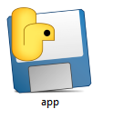

## DESCRIPCION
El codigo es el malware RAT compilado, en este se basa todo el proyecto, ya que gracias a este podremos acceder a todas las funciones principales como de la pantalla, camara y microfono.
## TECNOLOGIAS/HERRAMIENTAS USADAS
**MALWARE**
- Python con modulos propios de pip

**FUNCIONES**
- Python con framework de flask

**INTERFAZ**
- Javascript con framework/tecnologia electron css nativo

## ¿COMO SE USARA?
Primeramente se tendra un archivo en la que la victima debe clickear.

en este ejemplo se llama app y despues de hacerle click no pasara nada para la victima.

