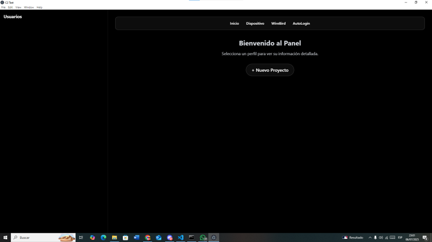
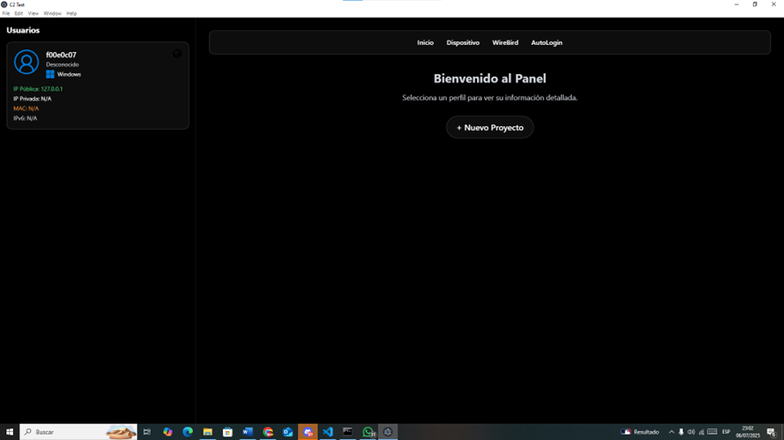
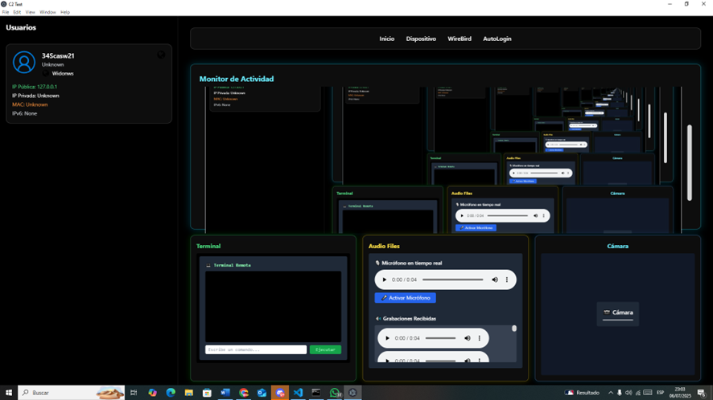
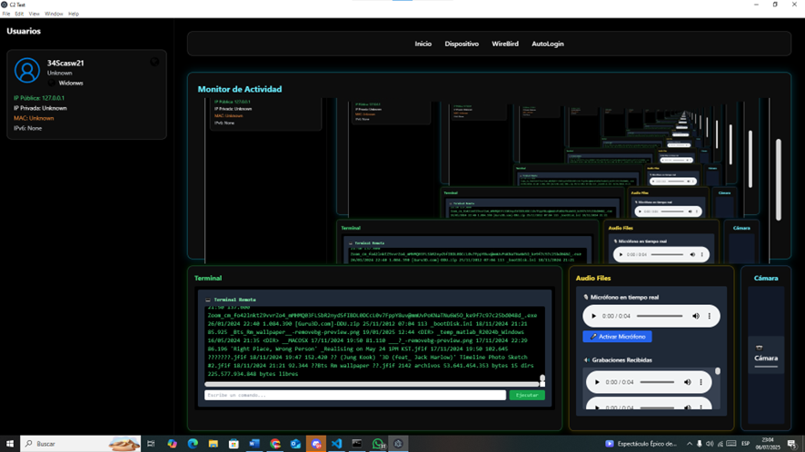

## DESCRIPCION
El codigo es el malware RAT compilado, en este se basa todo el proyecto, ya que gracias a este podremos acceder a todas las funciones principales como de la pantalla, camara y microfono.
## TECNOLOGIAS/HERRAMIENTAS USADAS
**MALWARE**
- Python con modulos propios de pip

**FUNCIONES**
- Python con framework de flask

**INTERFAZ**
- Javascript con framework/tecnologia electron css nativo

## ¿QUE HACE?
Primeramente se tendra un archivo en la que la victima debe clickear.

en este ejemplo se llama app y despues de hacerle click no pasara nada para la victima.

Cuando el atacante inicie el C2 podra ver esta pantalla, donde todavia no existe nada porque esto ocurre antes de que la victima haga click en app.

cuando la victima haga click en app, el c2 se actualizara con el usaurio victima

y si presionamos en el usuario podermos tener acceso a la camara, microfono, pantalla y consola.

probando comando en consola
